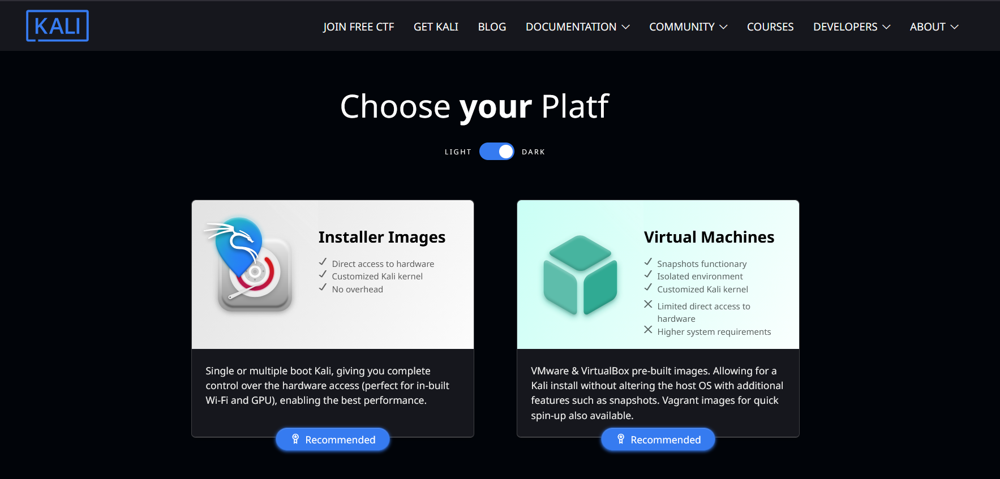
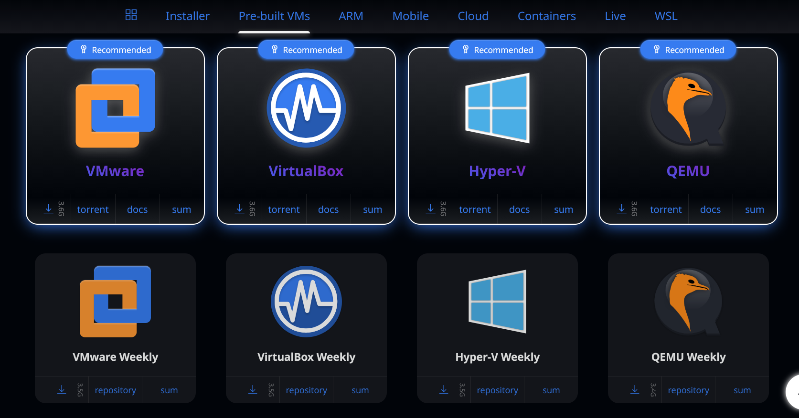
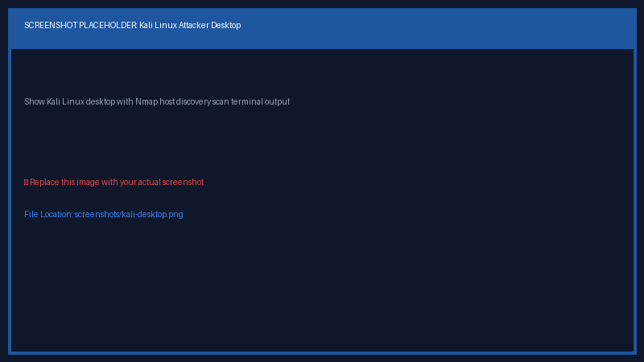

# Cybersecurity Home Lab 🛡️

Designed & Documented by **Francisco Elroy Afonso**  
*Junior Penetration Tester | Practical Ethical Hacker (PEH) | Google Cybersecurity Professional*

---

## 📌 Overview

This repository documents the deployment and configuration of my personal cybersecurity lab environment.

The lab provides a safe, isolated virtual workspace for practicing Linux administration, network security, penetration testing methodologies, and defensive security analysis.

---

## 🎯 Objectives & Achieved Goals

- **Linux Administration & CLI**: Installed and configured Kali Linux, mastering terminal commands, system navigation, package management, and system updates.
- **Hypervisor Management**: Configured VMware Workstation Pro 17.6.3, virtual hardware resource allocation, and NAT networking.
- **System Hardening & Driver Integration**: Configured `open-vm-tools-desktop` for display auto-fitting, input integration, and performance optimization.
- **Snapshot Management**: Implemented a clean baseline VM snapshot strategy for instant recovery.
- **Engineering Problem Solving**: Diagnosed and resolved guest input bugs (invisible mouse cursor rendering issue) through manual ISO installation and hardware compatibility management.

---

## 💻 Environment Specifications

| Component | Configuration |
| :--- | :--- |
| **Host System** | Windows 11 (25H2) |
| **Hypervisor** | VMware Workstation Pro 17.6.3 |
| **Guest VM** | Kali Linux (XFCE Desktop) |
| **Memory (RAM)** | 3 GB (3072 MB) |
| **Processors** | 1 CPU, 2 vCPU Cores |
| **Storage Disk** | 80 GB Thin Provisioned Virtual Disk |
| **Network Type** | NAT (`VMnet8`) |
| **Display Settings** | 3D Acceleration Disabled |

---

## ✅ Completed Setup Milestones

- [x] **Hypervisor Installation & Networking**: VMware Workstation Pro configured with NAT network isolation.
- [x] **Kali Linux Deployment**: Completed manual OS installation using official Kali Linux Installer ISO.
- [x] **Guest Driver Integration**: Installed and verified `open-vm-tools-desktop`.
- [x] **Baseline Snapshot**: Created clean baseline restore point in VMware.
- [x] **Troubleshooting & Fix Verification**: Diagnosed and resolved guest cursor rendering issue.

---

## 📂 Repository Structure & Documentation Index

```text
cybersecurity-home-lab/
├── README.md                           # Main repository overview & lab configuration
├── screenshots/                        # Visual setup verification & evidence
│   ├── vmware-settings.png            # VMware Workstation settings & NAT configuration
│   ├── kali-desktop.png               # Kali Linux XFCE desktop & terminal verification
│   ├── Chossing_Virtual_machines_instead_of_installer_images.png # Appliance vs ISO comparison
│   └── Download_recommended.png       # Official download options
└── docs/                               # Detailed lab deployment documentation
    ├── installation.md                 # Kali Linux ISO installation steps & key findings
    ├── vmware-configuration.md         # Resource allocation, NAT network & snapshot settings
    └── troubleshooting.md             # Real-world problem resolution (Invisible mouse cursor fix)
```

### 📚 Documentation Guides:
* 📘 [**Installation Guide (`docs/installation.md`)**](docs/installation.md): Detailed step-by-step setup of Kali Linux via Installer ISO and installation choices.
* ⚙️ [**VMware Configuration Guide (`docs/vmware-configuration.md`)**](docs/vmware-configuration.md): Resource allocation, NAT networking, and baseline snapshot procedures.
* 🛠️ [**Troubleshooting Guide (`docs/troubleshooting.md`)**](docs/troubleshooting.md): Detailed root cause analysis and resolution for the invisible mouse cursor bug.

---

## 📷 Visual Verification

### Virtual Machine Acquisition Options




### VMware Configuration & Kali Desktop




---

## 📜 License & Usage
This repository is built for educational, research, and defensive security testing purposes only.
