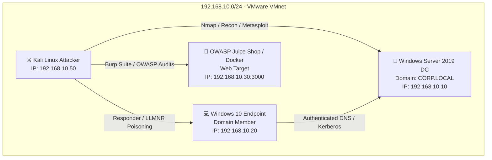

# Cybersecurity Home Lab Setup Guide 🛡️

[](docs/vmware-configuration.md)
[](docs/installation.md)
[](docs/networking.md)

Designed & Documented by **Francisco Elroy Afonso**  
*Junior Penetration Tester | Practical Ethical Hacker (PEH) | Google Cybersecurity Professional*

---

## 📌 Executive Summary

This repository contains the complete documentation, network architecture diagrams, step-by-step installation guides, and hypervisor configurations for an isolated enterprise **Cybersecurity Home Lab**.

The lab environment simulates a realistic enterprise network featuring an **Active Directory Domain Controller (CORP.LOCAL)**, a **Windows 10 Enterprise Endpoint**, a **Kali Linux Offensive Security Workstation**, and an **OWASP Juice Shop / DVWA Vulnerable Web Target**.

---

## 🗺️ Lab Network Architecture



---

## 💻 Virtual Machine Specification Summary

| Hostname | Operating System | Network Role | Assigned Static IP | Memory / Storage |
| :--- | :--- | :--- | :--- | :--- |
| **DC-01** | Windows Server 2019 / 2022 | AD DS Domain Controller (`CORP.LOCAL`), DNS Server | `192.168.10.10` | 4 GB RAM / 60 GB Disk |
| **WKSTN-01** | Windows 10 / 11 Enterprise | Domain-Joined Corporate Endpoint | `192.168.10.20` | 4 GB RAM / 50 GB Disk |
| **KALI-ATTACK** | Kali Linux (2024.x) | Offensive Security & Penetration Testing Workstation | `192.168.10.50` | 4 GB RAM / 40 GB Disk |
| **WEB-TARGET** | Ubuntu Linux / Docker | OWASP Juice Shop & DVWA Vulnerable Targets | `192.168.10.30` | 2 GB RAM / 30 GB Disk |

---

## 📂 Repository Structure & Documentation Index

```text
cybersecurity-home-lab/
├── README.md                           # Main overview & network topology
├── screenshots/                        # Environment visual verification
│   ├── vmware-settings.png            # Virtual Network Editor configuration
│   ├── kali-desktop.png               # Kali Linux terminal & scan output
│   └── network-config.png             # Domain Controller IP configuration
└── docs/                               # Detailed deployment guides
    ├── installation.md                 # AD DS, Windows 10, Kali & Docker deployment
    ├── vmware-configuration.md         # VMware Workstation & VMnet configuration
    └── networking.md                   # IP mapping, DNS routing & host isolation
```

* 📘 [**Installation Guide (`docs/installation.md`)**](docs/installation.md): Step-by-step setup of Active Directory, Windows 10 domain joining, Kali Linux, and Docker Juice Shop.
* ⚙️ [**VMware Configuration Guide (`docs/vmware-configuration.md`)**](docs/vmware-configuration.md): Virtual Network Editor setup, hardware allocation, and snapshot strategy.
* 🌐 [**Networking Guide (`docs/networking.md`)**](docs/networking.md): Subnet allocation, static routing, DNS resolution, and security isolation rules.

---

## 📷 Visual Verification

### VMware Virtual Network Setup


### Active Directory Domain Controller Network Configuration


### Kali Linux Offensive Workstation Setup


---

## 📜 License & Usage
This repository is built for educational, research, and defensive security testing purposes only.
