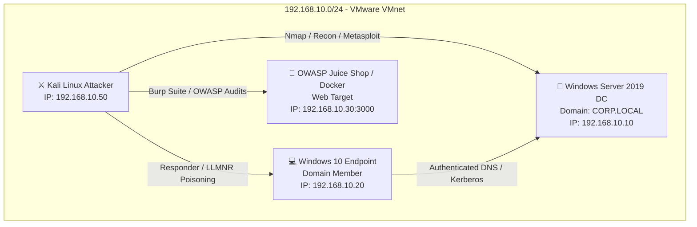
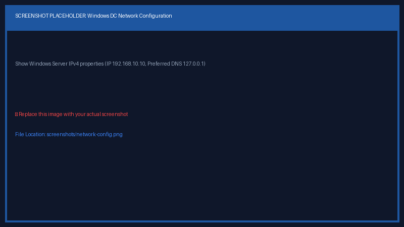

# Cybersecurity Home Lab 🛡️

[](docs/vmware-configuration.md)
[](docs/installation.md)
[](docs/networking.md)
[](docs/troubleshooting.md)

Designed & Documented by **Francisco Elroy Afonso**  
*Junior Penetration Tester | Practical Ethical Hacker (PEH) | Google Cybersecurity Professional*

---

## 📌 Executive Summary

This repository documents the setup and configuration of my personal **Cybersecurity Home Lab**. The environment is engineered for hands-on vulnerability assessments, Active Directory domain penetration testing, web application audits, and defensive security analysis—isolated securely from production host networks.

---

## 🎯 Lab Objectives

* **Active Directory Exploitation**: Practice Kerberoasting, AS-REP Roasting, LLMNR/NBT-NS Poisoning (Responder), and privilege escalation in a simulated enterprise domain (`CORP.LOCAL`).
* **Web Security Auditing**: Perform OWASP Top 10 security testing against vulnerable web applications (OWASP Juice Shop / DVWA) using Burp Suite Professional / Community.
* **Network Reconnaissance & Scanning**: Master Nmap ping sweeps, service versioning, and NSE scripts across custom subnets.
* **Engineering & Problem Resolution**: Document root causes, hypervisor network isolation, and troubleshooting procedures for career technical portfolio demonstration.

---

## 🗺️ Lab Network Architecture



---

## 💻 Virtual Machine Specifications

| Hostname | Operating System | Network Role | Static IP | Storage / Memory |
| :--- | :--- | :--- | :--- | :--- |
| **DC-01** | Windows Server 2019 / 2022 | AD DS Domain Controller (`CORP.LOCAL`), DNS Server | `192.168.10.10` | 4 GB RAM / 60 GB Disk |
| **WKSTN-01** | Windows 10 / 11 Enterprise | Domain-Joined Corporate Endpoint | `192.168.10.20` | 4 GB RAM / 50 GB Disk |
| **KALI-ATTACK** | Kali Linux (2024.x) | Offensive Security & Penetration Testing Workstation | `192.168.10.50` | 4 GB RAM / 40 GB Disk |
| **WEB-TARGET** | Ubuntu Linux / Docker | OWASP Juice Shop & DVWA Vulnerable Web Targets | `192.168.10.30` | 2 GB RAM / 30 GB Disk |

---

## 📂 Repository Structure & Documentation Index

```text
cybersecurity-home-lab/
├── README.md                           # Main portfolio overview & architecture
├── screenshots/                        # Environment visual evidence & verification
│   ├── vmware-settings.png            # Virtual Network Editor configuration
│   ├── kali-desktop.png               # Kali Linux terminal & scan output
│   ├── network-config.png             # Domain Controller static IP configuration
│   ├── Chossing_Virtual_machines_instead_of_installer_images.png # VM vs Installer options
│   └── Download_recommended.png       # Appliance vs ISO image download selection
└── docs/                               # Detailed deployment & troubleshooting guides
    ├── installation.md                 # Deployment steps (Pre-built OVA & ISO Installer)
    ├── vmware-configuration.md         # Virtual Network Editor & snapshot strategies
    ├── networking.md                   # IP mapping, DNS routing & host isolation
    └── troubleshooting.md             # Real-world problem resolution (Cursor bug, DNS fix)
```

### 📚 Detailed Guides:
* 📘 [**Installation Guide (`docs/installation.md`)**](docs/installation.md): Step-by-step installation instructions using both Pre-built VM Appliances (.OVA) and ISO Installer Images (.ISO).
* ⚙️ [**VMware Configuration Guide (`docs/vmware-configuration.md`)**](docs/vmware-configuration.md): Virtual Network Editor setup, hardware allocation, and baseline snapshot strategies.
* 🌐 [**Networking Guide (`docs/networking.md`)**](docs/networking.md): Subnet mapping, DNS routing (`CORP.LOCAL`), and security isolation rules.
* 🛠️ [**Troubleshooting Guide (`docs/troubleshooting.md`)**](docs/troubleshooting.md): Real-world technical hurdles, root cause analyses, and verified fixes (Invisible Mouse Cursor, DNS Domain Join failures).

---

## 📷 Visual Verification

### Virtual Machine Acquisition Options (Pre-built VM vs ISO Installer)


### VMware Virtual Network Setup


### Active Directory Domain Controller Network Configuration


### Kali Linux Offensive Workstation Setup


---

## 🚀 Technical Portfolio Roadmap

This repository represents the foundation of a progressive practical offensive security portfolio:

* 🟢 **`cybersecurity-home-lab`** *(Active)*: Enterprise network setup, AD domain, host isolation, & baseline configurations.
* 🟡 **`burp-suite-labs`**: Web security academy walkthroughs, proxy intercept configurations, & parameter tampering.
* 🟡 **`owasp-juice-shop-pentest`**: Full penetration testing report & vulnerability assessment against OWASP Juice Shop.
* 🟡 **`active-directory-lab`**: Advanced Active Directory attack vectors, Kerberoasting, BloodHound domain mapping, & GPO exploitation.
* 🟡 **`python-security-tools`**: Custom Python scripts for port scanning, banner grabbing, and credential brute-forcing.

---

## 📜 License & Usage
This repository is built for educational, research, and defensive security testing purposes only.

