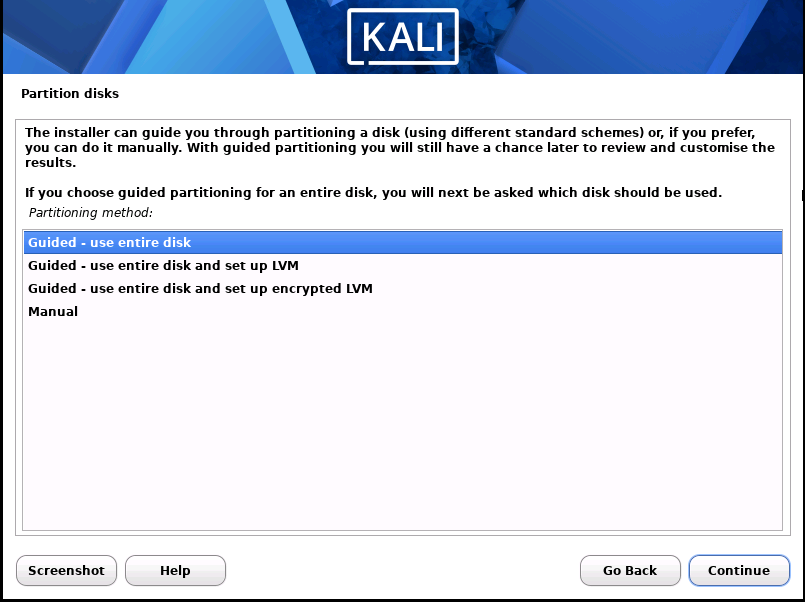
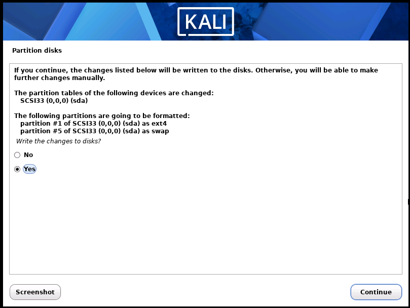
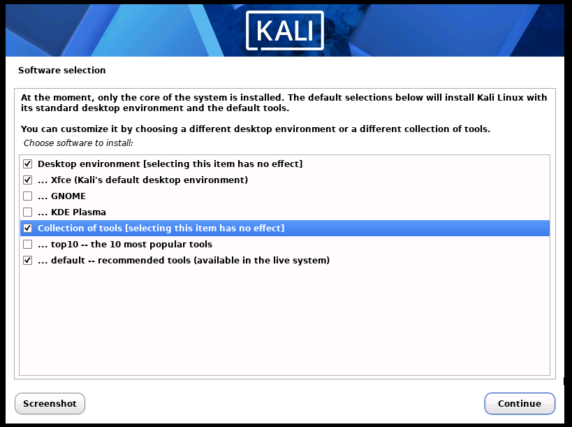
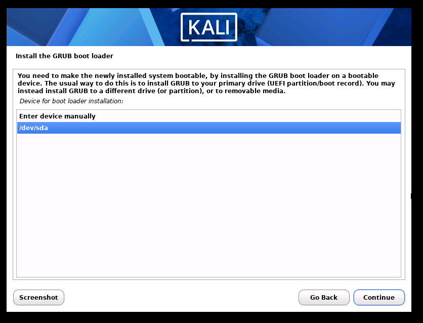

# Kali Linux Installation Documentation 🚀

This document details the step-by-step installation process, configuration choices, system updates, and guest driver setup for the Kali Linux virtual machine.

---

## 📌 Technical Specifications

| Parameter | Configuration Specification |
| :--- | :--- |
| **Operating System** | Kali Linux 2026.2 (64-bit) |
| **Media Source** | `kali-linux-2026.2-installer-amd64.iso` |
| **Hypervisor** | VMware Workstation Pro 17.6.3 |
| **Host System** | Windows 11 25H2 |
| **Allocated Memory** | 3 GB (3072 MB) |
| **Allocated Processors**| 1 CPU (2 vCPU Cores) |
| **Storage Provisioning**| 80 GB Thin Provisioned Virtual Disk |
| **Network Mode** | NAT (`VMnet8`) |
| **Desktop Environment**| XFCE |

---

## 🛠️ Step-by-Step Installation & Visual Verification

### 1. Media Selection & VM Hardware Allocation
* **Installer Media**: Selected official Kali Linux Installer ISO (`kali-linux-installer-amd64.iso`) over pre-packaged VM appliances to ensure native display driver detection and full disk partitioning control.
* **Resource Allocation**: Configured 3 GB RAM, 2 vCPU cores, and 80 GB virtual storage disk.


*Figure 1: Official Kali Linux Installer ISO media download.*


*Figure 2: Customizing virtual hardware settings (3 GB RAM, 2 Cores, 80 GB storage).*

---

### 2. Disk Partitioning & Operating System Installation
1. Booted virtual machine and launched **Graphical Install** from the GRUB boot menu.
2. Configured localization: Language (**English**), Country (**United States**), and Keymap (**American English**).
3. Set system hostname to `kali-attack` and created non-root administrative account (`kali`).
4. **Disk Partitioning**: Selected **Guided - use entire disk** with Ext4 primary partition and Swap space.
5. Confirmed partition changes and wrote file system changes to disk.


*Figure 3: Guided disk partitioning selection.*


*Figure 4: Writing partition layout and Ext4 file system modifications to disk.*

---

### 3. Software Selection & GRUB Bootloader Configuration
1. Accepted software selection choices: **XFCE Desktop Environment**, **top 10 tools**, and **default toolset**.
2. Installed GRUB bootloader to the primary virtual hard drive (`/dev/sda`).


*Figure 5: Software selection setup (XFCE desktop & default toolset).*


*Figure 6: Installing GRUB bootloader to primary disk /dev/sda.*

---

### 4. Post-Installation Commands & Driver Verification
Logged into Kali Linux and executed system package updates and guest integration tools:

```bash
# 1. Update package repository indexes and upgrade packages
sudo apt update && sudo apt upgrade -y

# 2. Install open-vm-tools-desktop for dynamic resolution and clipboard sharing
sudo apt install -y open-vm-tools-desktop

# 3. Reboot system to initialize updated display drivers
sudo reboot
```

Verified environment details post-reboot:

```bash
whoami
hostnamectl
uname -a
ip a
```


*Figure 7: Kali Linux XFCE desktop environment and terminal verification.*

---

## 📸 Snapshot Creation

After verifying system updates and display driver integration, a baseline snapshot was created in VMware Workstation:

* **Snapshot Name**: `Baseline Clean Setup`
* **State**: System powered off.
* **Purpose**: Establishes a known clean restoration baseline for system recovery.
