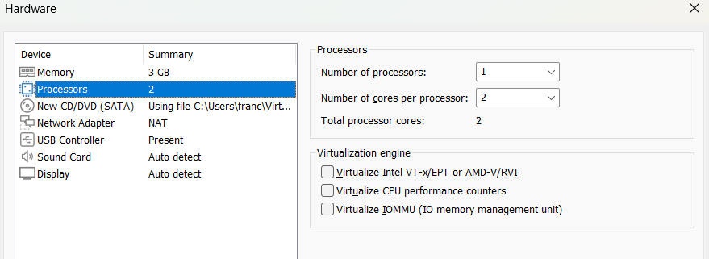

# VMware Workstation Configuration Documentation ⚙️

This document details the hypervisor configuration, virtual hardware resource allocation, network parameters, display settings, and snapshot strategy configured in VMware Workstation Pro 17.6.3.

---

## 💻 Resource Allocation Rationale

| Component | Configuration | Technical Rationale |
| :--- | :--- | :--- |
| **Hypervisor** | VMware Workstation Pro 17.6.3 | Provides hardware virtualization, network isolation controls, and snapshot management. |
| **Memory (RAM)** | 3 GB (3072 MB) | Allocates sufficient memory for XFCE desktop execution while reserving host RAM headroom. |
| **Processors** | 1 CPU (2 Cores) | Assigns 2 virtual CPU cores for parallel execution of CLI tools and background tasks. |
| **Disk Storage** | 80 GB Thin Provisioned | Reserves virtual disk capacity without immediately allocating 80 GB of host physical storage. |
| **Network Adapter** | NAT (`VMnet8`) | Routes guest traffic through host IP translation, enabling internet access while isolating from physical LAN. |
| **Display Settings** | 3D Acceleration Disabled | Disabling 3D acceleration prevents GPU driver rendering conflicts and display artifacts. |

*Figure 1: Virtual machine hardware custom allocation in VMware Workstation.*

---

## 🌐 Network Configuration Details

* **Adapter Mode**: NAT (`VMnet8`)
* **Subnet Addressing**: Managed dynamically by VMware virtual DHCP/NAT engine.
* **Gateway & DNS**: Resolved through VMware host network adapter interface.
* **Security Control**: Prevents external unsolicited inbound traffic from reaching guest interfaces.

*Figure 2: VMware Workstation virtual machine settings and network adapter summary.*

---

## 📸 Snapshot Strategy

VMware snapshots capture the virtual disk state and memory state of a virtual machine at a specific point in time.

### Baseline Snapshot
* **Name**: `Baseline Clean Setup`
* **Condition**: Created immediately after guest OS installation, system updates, and `open-vm-tools-desktop` driver verification.
* **Purpose**: Allows restoring the virtual machine to a known working state within seconds if system files or software packages become corrupted during testing.

*Figure 3: VMware Workstation Snapshot Manager showing the clean baseline snapshot.*

