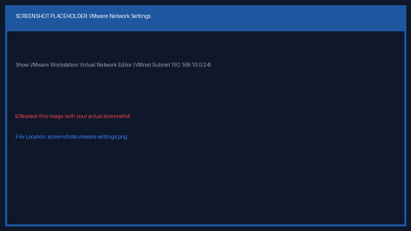

# VMware Workstation Hypervisor Configuration ⚙️

While virtualization engines such as Oracle VM VirtualBox can also be utilized, **VMware Workstation Pro / Player** is used throughout this write-up for hypervisor management, custom virtual networking, and snapshot trees.

---

## 1. Virtual Network Editor Setup (VMnet)

1. Open **VMware Workstation as Administrator**.
2. Go to **Edit** > **Virtual Network Editor**.
3. Click **Change Settings** to elevate permissions.
4. Add or edit a custom VMnet adapter (e.g., `VMnet8` or `VMnet2`):
   * **Network Type:** NAT or Host-Only (Isolated from external LAN).
   * **Subnet IP:** `192.168.10.0`
   * **Subnet Mask:** `255.255.255.0`
5. Ensure DHCP settings are set to lease addresses within `192.168.10.100 - 192.168.10.200` to prevent collisions with static IPs.

---

## 2. Resource Allocation Guidelines

| Machine | Recommended RAM | vCPU Cores | Disk Provisioning |
| :--- | :--- | :--- | :--- |
| **Domain Controller** | 4096 MB | 2 Cores | Thin Provision, 60 GB |
| **Windows 10 Client** | 4096 MB | 2 Cores | Thin Provision, 50 GB |
| **Kali Linux** | 4096 MB | 2 Cores | Thin Provision, 40 GB |
| **Ubuntu Target** | 2048 MB | 1 Core | Thin Provision, 30 GB |

---

## 3. VM Snapshot Strategy

Always take a **Clean Baseline Snapshot** before running security assessments:
1. Shut down all lab virtual machines.
2. Select VM > **VM** > **Snapshot** > **Take Snapshot...**.
3. Title: `Baseline Clean State - AD & Web Target Configured`.
4. Restore to this snapshot whenever testing destructive exploits or malware payloads.
